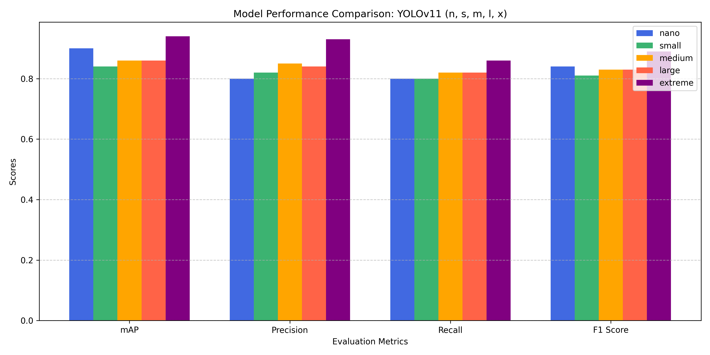

# Analyzing Pixel Contributions with Explainable AI on Autonomous Driving


## Overview and Background


## Table of Contents
```
yolov11-explainable-ai
|__ images
    |__ yolov11_txt_format.jpeg
|__ src
    |__ split_train_test.py
    |__ prediction.py
README.md
```

## Getting started

### Resources used
A high-performance desktop computer equipped with an AMD Ryzen Threadripper PRO 5975WX 32-Core CPU and a powerful NVIDIA GeForce RTX 4090 GPU (24GB RAM) has been utilized for the training. This system is further supported by 128GB of RAM, ensuring robust performance for demanding computational tasks. The GPU's advanced capabilities, including parallel processing, have been leveraged to optimize training time.

On the other hand, an Acer Nitro AN515-55 laptop powered by an Intel® Core™ i7-10750H CPU @ 2.60GHz and equipped with 48GB of RAM has been utilized for the rest of operations. This high-performance system ensures efficient handling of the prediction phase and evaluation metric computations for various tasks. The laptop's 64-bit operating system and x64-based processor architecture support modern computational operations, including processing predictions, generating evaluation metrics, and managing large datasets.

### Installing
The project is deployed in a local machine, so you need to install the next software and dependencies to start working:

1. Create and activate the new virtual environment for the project

```bash
conda create --name yolov11-explainable-ai python=3.10
conda activate yolov11-explainable-ai
```

2. Clone repository

```bash
git clone https://github.com/rafamartinezquiles/yolov11-explainable-ai.git
```

3. In the same folder that the requirements are, install the necessary requirements

```bash
cd yolov11-explainable-ai
pip install -r requirements.txt
```

### Setup
It is worth noting that the "Udacity Self Driving Car Dataset" provides functionality to download it in YOLOv11 format, which is recommended.

1. Retrieve the "Udacity Self Driving Car Dataset" in YOLOv11 format from the provided [link](https://public.roboflow.com/object-detection/self-driving-car/2). Download it as a zip file and ensure to place it within the main folder of the cloned repository named yolov11-explainable-ai.

```bash
mv /path/to/source /path/to/destination
```

2. Inside the cloned repository, execute the following command in order to unzip the "Udacity Self Driving Car Dataset" necessary for the project elaboration.

```bash
mkdir Udacity
tar -xf "Self Driving Car.v2-fixed-large.yolov11.zip" -C Udacity
```

3. Since the data is not divided into training, test and validation, we will run the following python file that will divide the data into 60% for training, 20% for validation and the remaining 20% for test taking into account the images and labels.

```bash
python src/split_train_test.py
```

4. A particularity that YOLOv11 has, being quite new, is the fact that in the .yaml file in which we specify the path to the training, validation and test data, we have to specify the complete path. For it, in this step, we open the file “data.yaml” and we modify the alternative routes so that they are complete. An example is the following:
```bash
train: c:\Users\user_name\Desktop\yolov11-explainable-ai\Udacity\train\images
```

## Training of neural networks
The training of the neural networks will be accomplished by executing the following command, passing a series of arguments that define the characteristics of the neural network. The arguments to be specified are:

- **data:** This parameter represents the path leading to the .yaml file associated to the dataset. It should be the complete path
- **epochs:** Denotes the number of training epochs. 
- **imgsz:** Refers to the image size utilized during training.
- **batch:** Specifies the batch size utilized during training.
- **name:** Represents the name assigned to the neural network.
- **patience:** Number of epochs to wait without improvement in validation metrics before early stopping the training.

An example of the command used for training, incorporating these parameters, is as follows:

```bash
!yolo task=detect mode=train model=yolo11n.pt data=complete_path/yolov11-explainable-ai/SDC/data.yaml epochs=400 imgsz=640 batch=16 name=yolov11_models_n patience=10
```

In case of not having the necessary time or resources to train the neural networks, you can access the weights and training information of the neural networks in the following [link](https://drive.google.com/drive/folders/1M1R6dTDRGQSBAA3VU1CibKp3VIcQFow9?usp=drive_link).

## Extracting Labels After Prediction
This section covers the process of executing a script to create a new folder containing labels associated with the predictions from the test folder. Each label file will share the same name as its corresponding original image but will use a .txt extension instead of the image extension (e.g., .jpg or .png). This format allows for easy comparison with the original labels to compute evaluation metrics. The script can be executed as follows:

```bash
python prediction.py --model complete_path\yolov11_models_s\weights\best.pt --source complete_path\test\images
```

Executing this command yields several key results. First, it provides the average times in milliseconds for preprocessing, inference, and postprocessing, offering insights into the model's efficiency. Additionally, it outputs the total number of tags detected during the process. Finally, it generates a folder containing all the detected tags in .txt format, which can be used subsequently to calculate the desired evaluation metrics.

## Evaluation Metrics
For evaluating the performance of our model trained on this dataset, the following evaluation metrics are appropriate and their meaning will be the following. But before going into each of the evaluation metrics, it is necessary to highlight the way in which the labels are formed in order to understand how they work.

The labels in this dataset adhere to the YOLOv11 TXT format, which ensures consistency and compatibility with the YOLO framework. Each image is associated with a .txt file containing a line for each bounding box. The structure of each row is:

```bash
class_id center_x center_y width height
```


Also, the values are normalized ensuring that the bounding box coordinates are independent of image resolution, scaling them to fall within the range of 0 to 1.

### Mean Average Precision (mAP)
Mean Average Precision (mAP) is a widely used metric in object detection that evaluates the overall performance of a model in identifying objects. It combines precision and recall by calculating the average precision across all object classes. A high mAP value indicates that the model consistently detects objects correctly across multiple categories, with both high precision (few false positives) and high recall (few false negatives). Conversely, a low mAP suggests that the model struggles with either identifying objects or avoiding false positives, making it an important indicator of model effectiveness in real-world applications.

### Precision and Recall 
Precision and recall are fundamental metrics that assess a model's ability to detect relevant objects. Precision measures the proportion of true positives (correct detections) out of all predicted positives, representing how accurate the model is when it claims to have detected an object. Recall, on the other hand, measures the proportion of true positives out of all actual objects, indicating how well the model captures all the relevant instances. In object detection for autonomous driving, precision and recall are crucial for ensuring that the model identifies objects accurately while minimizing missed detections and false positives.

### F1 Score
The F1 score is a balanced metric that combines precision and recall into a single value, offering a more comprehensive view of a model's performance. It is the harmonic mean of precision and recall, where a higher F1 score indicates a model that performs well in both detecting objects accurately and capturing as many relevant objects as possible. In autonomous driving applications, a high F1 score is essential because it ensures that the object detection system is both reliable and comprehensive, making it a critical measure for evaluating model performance.


### Calculation with the code
This code is designed to evaluate the performance of object detection models by comparing predicted bounding boxes with ground truth bounding boxes. It parses YOLO format label files, computes Intersection over Union (IoU) to match predicted boxes to ground truth boxes, and then calculates precision, recall, F1 score, and mean Average Precision (mAP). 

```bash
python evaluation_metrics.py <original_labels_folder> <predicted_labels_folder>
```

## Additional Task - Evaluation Metrics Comparison Graph
In this section we will show how to execute the code associated with the following representation:




